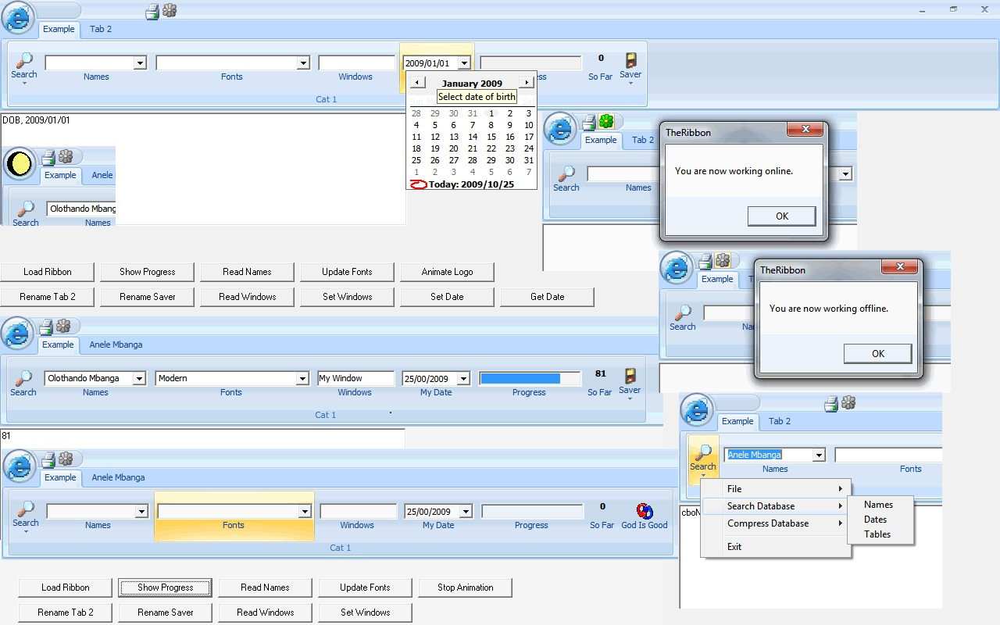



## Office 2007 Ribbon

### Description

This is an advanced Office 2007 Ribbon that was originally developed by adrianopaladini@gmail.com here in PSC. I have added some enhancements to it (see the screenshot). They are addition of textbox, combobox, datepicker, progress bar, label on buttons, animation of main icon, see timer functions on form 1, ability to edit the top button, edit the tab caption and button caption including icons thereof, buttons now have menus that can be assigned to them, buttons and tabs are no longer limited to 90 buttons as originally released but a redimensionable array has been used across the board, menus, buttons can be added depending on the permissions per button, the permission string must contain the ids of a button separated by. If you like please vote for me. You will find this awesome so please vote for me.
 
### More Info
 
This is an advanced Office 2007 Ribbon that was originally developed by adrianopaladini@gmail.com here in PSC. I have added some enhancements to it (see the screenshot). They are addition of textbox, combobox, datepicker, progress bar, label on buttons, animation of main icon, see timer functions on form 1, ability to edit the top button, edit the tab caption and button caption including icons thereof, buttons now have menus that can be assigned to them, buttons and tabs are no longer limited to 90 buttons as originally released but a redimensionable array has been used across the board, menus, buttons can be added depending on the permissions per button, the permission string must contain the ids of a button separated by. If you like please vote for me. You will find this awesome so please vote for me.

             |
---                |---
**Submitted On**   |2009-10-25 09:50:02
**By**             |[Anele Mbanga](https://github.com/Planet-Source-Code/PSCIndex/blob/master/ByAuthor/anele-mbanga.md)
**Level**          |Advanced
**User Rating**    |4.8 (24 globes from 5 users)
**Compatibility**  |VB 6\.0
**Category**       |[Complete Applications](https://github.com/Planet-Source-Code/PSCIndex/blob/master/ByCategory/complete-applications__1-27.md)
**World**          |[Visual Basic](https://github.com/Planet-Source-Code/PSCIndex/blob/master/ByWorld/visual-basic.md)
**Archive File**   |[Office\_20021660510252009\.zip](https://github.com/Planet-Source-Code/anele-mbanga-office-2007-ribbon__1-72588/archive/master.zip)

